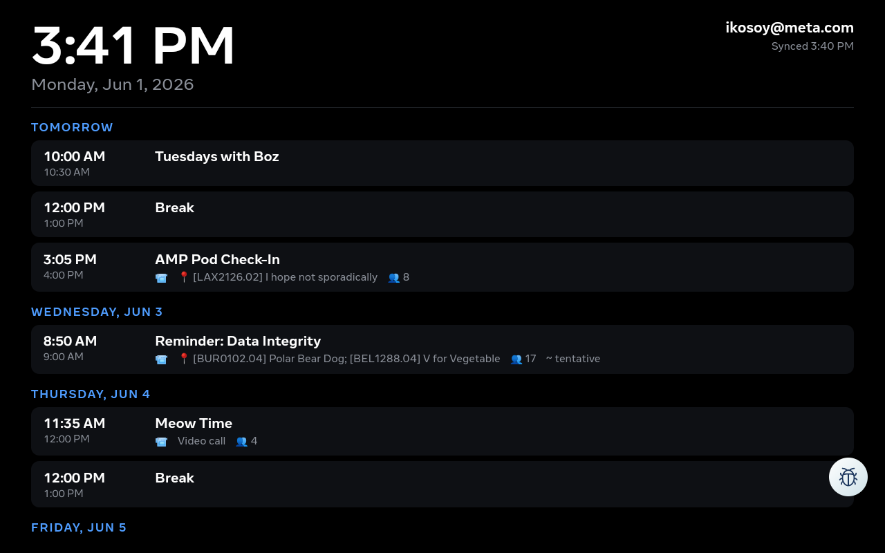

# Portal Calendar — Summary

An always-on **agenda display** for a Meta **Portal** device. It shows your
upcoming work (Google) calendar as a clean, full-screen list on a black
background, with a live clock — turning a Portal into a desk calendar.



## What it does

- Displays your next ~7 days of meetings, grouped by **Today / Tomorrow / weekday**.
- Shows time, title, room/location 📍, video-call 📹, attendee count 👥, and
  tentative status for each event.
- Highlights the meeting that's happening **now**.
- Big clock + date header; auto-refreshes throughout the day.

## How it works (no sign-in on the device)

The Portal can't sign into a corp Google account (no Google Play Services, and
Workspace blocks adding the account). So **authentication never happens on the
device**. Instead:

1. A small **exporter** runs on your Mac, fetches your calendar via the `meta`
   CLI, and writes `events.json`.
2. It **pushes** `events.json` to the Portal over local `adb` (the Portal is
   USB-attached to the Mac).
3. The **app** is a thin WebView that just renders whatever `events.json` it's
   given, refreshing every 30s.

```
Mac cron → meta calendar → events.json → adb push → Portal app renders
```

## Pieces

| Path | What |
|---|---|
| `app/` | The Android app (WebView shell + `assets/` web UI), built with buck2 |
| `exporter/calendar_sync.py` | Fetches + pushes your calendar (runs on the Mac) |
| `scripts/` | `build.sh`, `deploy.sh`, `schedule.sh` |
| `dist/PortalCalendar.apk` | Prebuilt, signed APK you can sideload directly |

## Sharing

The app is **not** account-specific — anyone can install the same APK and point
the exporter at their own account. See [INSTALL.md](INSTALL.md) and
[CONFIG.md](CONFIG.md).
